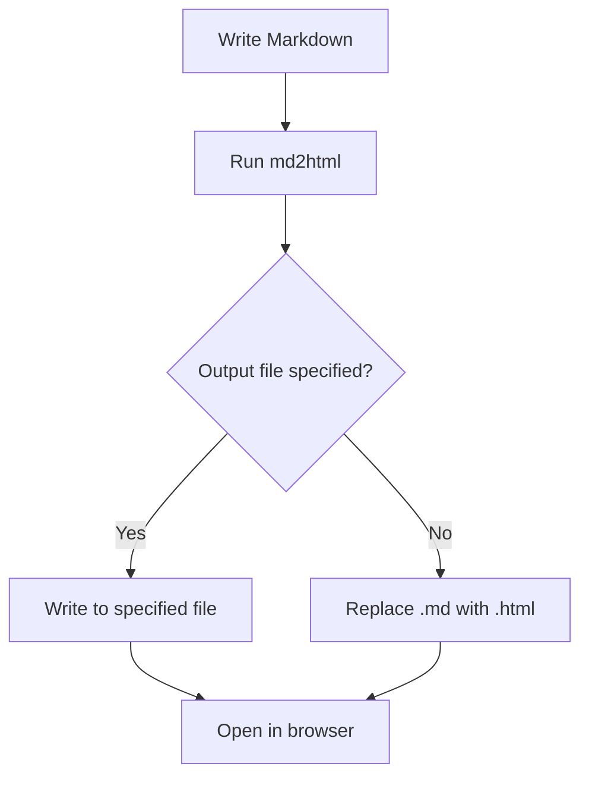

# Markdown to HTML Converter

This is a sample markdown file to demonstrate the **md2html** converter.

## Features

- ✅ Modern, clean styling
- ✅ Automatic dark mode support
- ✅ Syntax highlighting for code blocks
- ✅ Responsive design

## Code Example

Here's a JavaScript function:

```javascript
function greet(name) {
  console.log(`Hello, ${name}!`);
  return `Welcome to md2html`;
}

const result = greet("World");
```

## Python Example

```python
def fibonacci(n):
    if n <= 1:
        return n
    return fibonacci(n-1) + fibonacci(n-2)

print([fibonacci(i) for i in range(10)])
```

## Lists

### Unordered List
- Item 1
- Item 2
  - Nested item
  - Another nested item
- Item 3

### Ordered List
1. First item
2. Second item
3. Third item

## Blockquote

> This is a blockquote. It can contain multiple paragraphs and other markdown elements.
> 
> The styling automatically adapts to light and dark themes.

## Table

| Feature | Supported | Notes |
|---------|-----------|-------|
| Headers | ✅ | H1-H6 |
| Code blocks | ✅ | With syntax highlighting |
| Tables | ✅ | Responsive |
| Dark mode | ✅ | Automatic |
| Mermaid diagrams | ✅ | Flowcharts, sequences, and more |

## Mermaid Diagram



## Links

Visit [GitHub](https://github.com) or check out the [documentation](https://docs.github.com).

---

*This converter creates beautiful, modern HTML from your markdown files!*